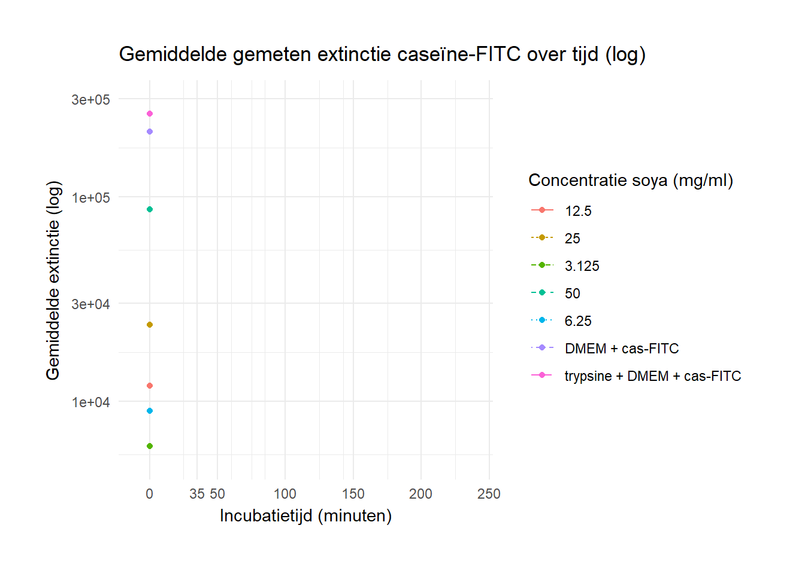

# <span style="color:#E656AE;">New Packages</span> {-} 

## Visualisation microplate assay {-}
For my internship at the HU Lectoraat of Innovative Testing in Life Sciences and Chemistry, I am working with a lot of data obtained from a microplate reader. To visualize this data I have already used a lot of the functions of the `ggplot2` package, which I learned in this course. 

Now I was wondering if there were maybe more packages that would help me analyse these kind of data since I know I will work with similar data in the future. 

I have already made scripts like this:

```{r, eval=FALSE, echo=TRUE}
# Laad de benodigde bibliotheken
library(readxl)
library(ggplot2)
library(gridExtra)
library(dplyr)

# Data inlezen van soja met caseine-FITC
tryp_alb_soy <- read_excel("20241028_AlbFITC_soja_alg.xlsx", sheet = "soy_tryp")
pep_pep_alb_soy <- read_excel("20241028_AlbFITC_soja_alg.xlsx", sheet = "soy_pep")
pan_pep_alb_soy <- read_excel("20241028_AlbFITC_soja_alg.xlsx", sheet = "soy_pan")
pan_pep_alb_soy <- read_excel("20241028_AlbFITC_soja_alg.xlsx", sheet = "soy_pep_pan")

# Data inlezen van alg met caseïne-FITC
tryp_alb_alg <- read_excel("20241028_AlbFITC_soja_alg.xlsx", sheet = "alg_tryp")
pep_pep_alb_alg <- read_excel("20241028_AlbFITC_soja_alg.xlsx", sheet = "alg_pep")
pan_pep_alb_alg <- read_excel("20241028_AlbFITC_soja_alg.xlsx", sheet = "alg_pan")
pan_pep_alb_alg <- read_excel("20241028_AlbFITC_soja_alg.xlsx", sheet = "alg_pep_pan")

# Definieer de levels voor concentratie_peptones op één plek
concentratie_levels <- c("pepsine + pancreatine + DMEM + alb-FITC", "DMEM + alb-FITC", 
                         "3.125", "6.25", "12.5", "25", "50")

# Zet de factor levels voor soja datasets
for (data in list(tryp_alb_soy, pep_pep_alb_soy, pan_pep_alb_soy)) {
  data$concentratie_peptones <- factor(data$concentratie_peptones, levels = concentratie_levels)
}

# Zet de factor levels voor alg datasets
for (data in list(tryp_alb_alg, pep_pep_alb_alg, pan_pep_alb_alg)) {
  data$concentratie_peptones <- factor(data$concentratie_peptones, levels = concentratie_levels)
}

# Update de stijl voor de controlecondities
linetype_values <- c("trypsine + DMEM + alb-FITC" = "dashed", 
                     "DMEM + alb-FITC" = "dashed",
                     "pepsine + DMEM + alb-FITC" = "dashed",
                     "pancreatine + DMEM + alb-FITC" = "dashed",
                     "pepsine + pancreatine + DMEM + alb-FITC" = "dashed",
                     "3.125" = "solid", "6.25" = "solid", 
                     "12.5" = "solid", "25" = "solid", "50" = "solid")

common_colors <- c(
  "trypsine + DMEM + alb-FITC" = "blue",
  "DMEM + alb-FITC" = "red",
  "pepsine + DMEM + alb-FITC" = "green",
  "pancreatine + DMEM + alb-FITC" = "purple",
  "pepsine + pancreatine + DMEM + alb-FITC" = "orange",
  "3.125" = "cyan4",
  "6.25" = "magenta",
  "12.5" = "yellow3",
  "25" = "brown3",
  "50" = "darkblue"
)

# Functie om grafieken te genereren
plot_function <- function(data, title_text, concentration_label,
                          add_annotation = FALSE, add_pepsine_t = FALSE, 
                          add_pancreatine_annotation = FALSE, add_pan_t = FALSE) {
  p <- ggplot(data, aes(x = as.numeric(incubatietijd_min), y = gemiddelde_extinctie_meting, 
                        color = factor(concentratie_peptones), 
                        group = factor(concentratie_peptones), 
                        linetype = factor(concentratie_peptones))) +
    geom_line() +  
    geom_point() +
    scale_y_log10(expand = c(0.1, 0)) +  
    scale_x_continuous(breaks = c(scales::pretty_breaks()(range(as.numeric(data$incubatietijd_min))), 35), 
                       expand = c(0.1, 0)) +  
    scale_color_manual(values = common_colors) +
    scale_linetype_manual(values = linetype_values) +
    labs(title = title_text,
         x = "Incubatietijd (minuten)",
         y = "Gemiddelde extinctie (log)",
         color = concentration_label,
         linetype = concentration_label) +
    theme_minimal() +
    theme(plot.margin = unit(c(1, 1, 1, 1), "cm"))
  
  # Voeg annotaties toe
  if (add_annotation) {
    p <- p + 
      geom_vline(xintercept = 50, linetype = "dotted", color = "grey50", size = 0.7) +
      annotate("text", x = 50, y = Inf, label = "afbraak door pepsine", 
               vjust = -1, hjust = 1.1, color = "grey30", angle = 90, size = 3.5)
  }
  if (add_pancreatine_annotation) {
    p <- p +
      geom_vline(xintercept = 230, linetype = "dotted", color = "grey50", size = 0.7) +
      annotate("text", x = 230, y = Inf, label = "afbraak door pancreatine", 
               vjust = -1, hjust = 1.1, color = "grey30", angle = 90, size = 3.5)
  }
  if (add_pepsine_t) {
    p <- p +
      geom_vline(xintercept = 15, linetype = "dotted", color = "grey50", size = 0.7) +
      annotate("text", x = 15, y = Inf, label = "toevoeging van pepsine", 
               vjust = -1, hjust = 1.1, color = "grey30", angle = 90, size = 3.5)
  }
  if (add_pan_t) {
    p <- p +
      geom_vline(xintercept = 60, linetype = "dotted", color = "grey50", size = 0.7) +
      annotate("text", x = 60, y = Inf, label = "toevoeging van pancreatine", 
               vjust = -1, hjust = 1.1, color = "grey30", angle = 90, size = 3.5)
  }
  return(p)
}

# Plot de grafieken voor soja
tryp_alb_plot_soy <- plot_function(tryp_alb_soy, "Gemiddelde gemeten extinctie albumine-FITC \nover tijd vrijgekomen na eiwitafbraak door trypsine (log)", "Concentratie soja (mg/ml)")
pep_pep_alb_plot_soy <- plot_function(pep_pep_alb_soy, "Gemiddelde gemeten extinctie albumine-FITC \nover tijd vrijgekomen na eiwitafbraak door pepsine (log)", "Concentratie soja (mg/ml)", add_annotation = TRUE, add_pepsine_t = TRUE)
pan_pep_alb_plot_soy <- plot_function(pan_pep_alb_soy, "Gemiddelde gemeten extinctie albumine-FITC \nover tijd vrijgekomen na eiwitafbraak door pancreatine (log)", "Concentratie soja (mg/ml)", add_pancreatine_annotation = TRUE, add_pan_t = TRUE)
pan_pep_alb_plot_soy <- plot_function(pan_pep_alb_soy, "Gemiddelde gemeten extinctie albumine-FITC \nover tijd vrijgekomen na eiwitafbraak door pepsine en pancreatine (log)", "Concentratie soja (mg/ml)", add_annotation = TRUE, add_pancreatine_annotation = TRUE, add_pepsine_t = TRUE, add_pan_t = TRUE)

# Plot de grafieken voor alg
tryp_alb_plot_alg <- plot_function(tryp_alb_alg, "Gemiddelde gemeten extinctie albumine-FITC \nover tijd vrijgekomen na eiwitafbraak door trypsine (log)", "Concentratie alg (mg/ml)")
pep_pep_alb_plot_alg <- plot_function(pep_pep_alb_alg, "Gemiddelde gemeten extinctie albumine-FITC \nover tijd vrijgekomen na eiwitafbraak door pepsine (log)", "Concentratie alg (mg/ml)")
pan_pep_alb_plot_alg <- plot_function(pan_pep_alb_alg, "Gemiddelde gemeten extinctie albumine-FITC \nover tijd vrijgekomen na eiwitafbraak door pancreatine (log)", "Concentratie alg (mg/ml)")
pan_pep_alb_plot_alg <- plot_function(pan_pep_alb_alg, "Gemiddelde gemeten extinctie albumine-FITC \nover tijd vrijgekomen na eiwitafbraak door pepsine en pancreatine (log)", "Concentratie alg (mg/ml)", add_annotation = TRUE, add_pancreatine_annotation = TRUE, add_pepsine_t = TRUE, add_pan_t = TRUE)

# Combineer de plots voor pepsine en pancreatine
pan_pep <- grid.arrange(pan_pep_alb_plot_alg, pan_pep_alb_plot_soy, ncol = 1)
```


## plater {-}
When I was looking for more packages I came across `plater`. It is not exactly a package in which you can visualise your data, but more for organizing it to work in Rstudio with `tidyverse`. Learning to use the package seemed very useful to me.
Plater makes it easier to work with data from experimetns perfomed in plates. The point is to seasmlessly convert plate-shaped date (easy to think about) into tidy date(easy to analyse). This package does this by defining a simple, systematic format for storing information into plate layouts, followed by rearraging the data into a tidy format frame.  
--- 
To get familiar with the package I came across an example. 

In this example we have invented to new antibiotics. To examine the working of these two, we filled up a 96-well plate with dilutions of the antibiotics and four types of bacteria. We are measuring the amount of bacteria that got killed. 

So in each well of the plate we have:

1. Antibiotic A or B 

2. Concentration of the drug (100 uM to 0.01 nM and no drug) 

3. Bacterial species *(E. coli, S. enterocolitis, C. trachomatis, and N. gonorrhoeae)*

4. Amount of killed bacteria. 

--- 

First we begin with installing the package.

```{r, warning=FALSE}
# install.packages("plater")
library(plater)
```


There is a format file available for this example experiment what looks like this:


I tried to test it on my own data but I have encoutered a lot of errors. Whenever I made a .csv file and I tried to load it in, it responded with "it seems like you want to work with two plates". I have tried to resolve it but it took a lot of time so I decided to move on with another package. 


```{r}
library(plater)
file_path <- system.file("extdata", "example-1.csv", package = "plater")

data <- read_plate(
      file = file_path,             # full path to the .csv file
      well_ids_column = "Wells",    # name to give column of well IDs (optional)
      sep = ","                     # separator used in the csv file (optional)
)
str(data)

head(data)

```

```{r, eval=FALSE, echo=TRUE}
# make a dataframe 
test_data <- data.frame(
  well = c(
    "A1", "A2", "A3", "A4", "A5", "A6", "A7", "A8", "A9", "A10", "A11", "A12",
    "B1", "B2", "B3", "B4", "B5", "B6", "B7", "B8", "B9", "B10", "B11", "B12",
    "C1", "C2", "C3", "C4", "C5", "C6", "C7", "C8", "C9", "C10", "C11", "C12",
    "D1", "D2", "D3", "D4", "D5", "D6", "D7", "D8", "D9", "D10", "D11", "D12",
    "E1", "E2", "E3", "E4", "E5", "E6", "E7", "E8", "E9", "E10", "E11", "E12",
    "F1", "F2", "F3", "F4", "F5", "F6", "F7", "F8", "F9", "F10", "F11", "F12",
    "G1", "G2", "G3", "G4", "G5", "G6", "G7", "G8", "G9", "G10", "G11", "G12",
    "H1", "H2", "H3", "H4", "H5", "H6", "H7", "H8", "H9", "H10", "H11", "H12"
  ),
  monster = c(
    "NC", "NC", "tryp100", "tryp100", "tryp100", "tryp100", "tryp100", "tryp100", "tryp100", "tryp100", "tryp100", "tryp100",
    "dmem", "dmem", "tryp50", "tryp50", "tryp50", "tryp50", "tryp50", "tryp50", "tryp50", "tryp50", "tryp50", "tryp50",
    "pep", "pep", "pept_cas", "pept_cas", "pep_pan", "pep_pan", "pep_pan", "pep_pan", "pep_pan", "pep_pan", "pep_pan", "pep_pan",
    "tryp12", "tryp12", "pan_cas", "pan_cas", "pan", "pan", "pan", "pan", "pan", "pan", "pept_tryp", "pept_tryp"
  ),
  absorbance = c(
    0.747, 0.738, 0.762, 0.838, 0.818, 0.785, 0.859, 0.898, 0.880, 0.862, 0.828, 0.842,
    0.764, 0.715, 0.746, 0.915, 0.926, 0.935, 0.980, 0.986, 0.954, 1.016, 1.014, 1.062,
    0.744, 0.727, 0.726, 0.746, 0.711, 0.717, 0.788, 0.765, 0.804, 0.785, 0.751, 0.817,
    0.707, 0.682, 0.726, 0.702, 0.738, 0.715, 0.754, 0.819, 0.742, 0.803, 0.780, 0.829,
    0.720, 0.675, 0.823, 0.782, 0.788, 0.749, 0.758, 0.738, 0.842, 0.880, 0.807, 1.052,
    0.823, 0.827, 0.791, 0.875, 0.950, 1.006, 0.930, 0.998, 1.354, 1.020, 1.051, 1.099,
    0.886, 0.777, 0.691, 0.723, 0.704, 0.731, 0.753, 0.781, 0.727, 0.808, 0.819, 0.835,
    3.500, 0.708, 0.648, 0.796, 0.741, 0.770, 0.766, 0.782, 0.774, 0.888, 0.911, 0.966
  )
)

# convert to CSV
write.csv(test_data, row.names = FALSE)

library(plater)

data <- read_plates(
      file = test_data,             # full path to the .csv file
      well_ids_column = "Wells",    # name to give column of well IDs (optional)
      sep = ","                     # separator used in the csv file (optional)
)
str(data)

head(data)
```

--- 

## gganimate {-} 

I've been exploring the gganimate package, which allows me to create time-based plots for my data. Specifically, I'm interested in visualizing how long it takes for trypsin to break down all the proteins in my sample, given varying concentrations of trypsin. This package transforms static line graphs into dynamic animations, showing changes over time in a clear and engaging way.

```{r, message=FALSE, warning=FALSE}
# install.packages("gifski")
# install.packages("av")
# install.packages("magick")

```


```{r, warning=FALSE, message=FALSE}
library(readxl)
library(ggplot2)
library(gridExtra)
library(dplyr)
library(gganimate)

# Data inlezen
tryp_cas_alg <- read_excel("~/stagedocumenten/20241028_CasFITC_soja_alg.xlsx", sheet = "alg_tryp")

# Functie om grafieken te genereren met optionele verticale stippellijn en label
plot_function_alg <- function(data, title_text) {
  p <- ggplot(data, aes(x = as.numeric(incubatietijd_min), y = gemiddelde_extinctie_meting, 
                        color = factor(concentratie_peptones), 
                        group = factor(concentratie_peptones), 
                        linetype = factor(concentratie_peptones))) +
    geom_line() +  
    geom_point() +
    scale_y_log10(expand = c(0.1, 0)) +  
    scale_x_continuous(breaks = c(scales::pretty_breaks()(range(as.numeric(data$incubatietijd_min))), 35), 
                       expand = c(0.1, 0)) +  
    labs(title = title_text,
         x = "Incubatietijd (minuten)",
         y = "Gemiddelde extinctie (log)",
         color = "Concentratie soya (mg/ml)",
         linetype = "Concentratie soya (mg/ml)") +
    theme_minimal() +
    theme(plot.margin = unit(c(1, 1, 1, 1), "cm"))

  return(p)
}

# Geanimeerde grafiek maken
animated_plot <- plot_function_alg(tryp_cas_alg, "Gemiddelde gemeten extinctie caseïne-FITC over tijd (log)") +
  transition_reveal(as.numeric(incubatietijd_min))

# Geanimeerde grafiek maken met gekozen rendering-engine
animated_plot <- plot_function_alg(tryp_cas_alg, "Gemiddelde gemeten extinctie caseïne-FITC over tijd (log)") +
  transition_reveal(as.numeric(incubatietijd_min))

# save as gif 
anim_save("animated_plot.gif", animated_plot)

```



---

## qPCR {-} 

Next, I wanted to learn how to analyse qPCR data as this is also a method I will be using more often in the future. 

When looking online, I came across the "delta-delta-ct- method".

```{r, eval=FALSE}
# Load required libraries
library(tidyverse)
library(pcr)
library(rstatix)

# Simulated qPCR data (replace with your dataset)
qpcr_data <- data.frame(
  Sample = rep(c("Control", "protein"), each = 3),
  Target_Gene = rep(c("IL6", "TNF", "IL10"), 2),
  Ct_Value = c(25, 24, 26, 22, 21, 23) # Example Ct values
)

# Normalize using a housekeeping gene (simulated data, replace with actual housekeeping Ct)
housekeeping_ct <- c(Control = 20, protein = 19) # Example housekeeping Ct values
qpcr_data <- qpcr_data %>%
  mutate(delta_Ct = Ct_Value - housekeeping_ct[Sample])

# Calculate ΔΔCt and fold change
qpcr_data <- qpcr_data %>%
  group_by(Target_Gene) %>%
  mutate(delta_delta_Ct = delta_Ct - mean(delta_Ct[Sample == "Control"]),
         fold_change = 2^(-delta_delta_Ct))

# Visualize fold changes
fold_change_plot <- ggplot(qpcr_data, aes(x = Target_Gene, y = fold_change, fill = Sample)) +
  geom_bar(stat = "identity", position = "dodge") +
  labs(title = "Fold Change in Cytokine Expression",
       x = "Cytokine",
       y = "Fold Change") +
  theme_minimal()
print(fold_change_plot)

# Perform statistical testing to identify significant changes
stats <- qpcr_data %>%
  group_by(Target_Gene) %>%
  t_test(fold_change ~ Sample, paired = FALSE) %>%
  adjust_pvalue(method = "bonferroni")
print(stats)
```

I've watched youtube videos:
https://www.youtube.com/watch?v=Uj0uDpNgc7U
https://www.youtube.com/watch?v=zl3T8b5DJPs

But I still have not obtained my own data so I can not test it out yet. 
